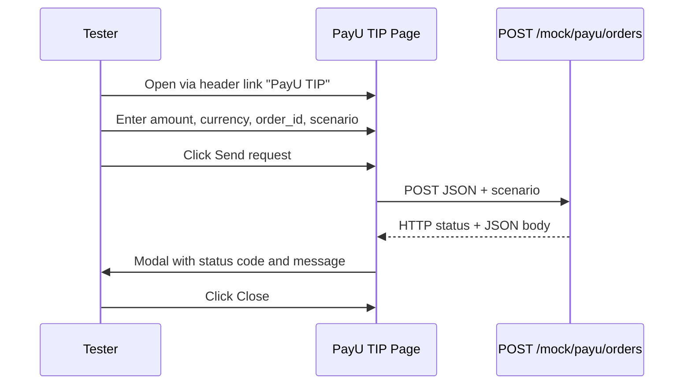

# US9200 - PayU TIP testing UI for mock payment requests

Background: US9100 introduced the embedded mock PayU service (`POST /mock/payu/orders`) with configurable scenarios. Testers currently need tools such as Postman or curl to call the mock directly and explore success and failure responses. A dedicated in-app UI lowers the barrier for manual and exploratory testing during holistic testing workshops.

## User Story: PayU TIP testing UI

As a tester,
I want a dedicated PayU TIP page in the web shop where I can send requests to the mock PayU payment service,
so that I can quickly try different payment payloads and scenarios and see the HTTP response without leaving the application or using external API clients.

## Acceptance Criteria:

### UC1: Header navigation link opens PayU TIP page

Given the user is on any page of the web shop
When  the main header navigation is displayed
Then  a nav link labelled **PayU TIP** is visible in the header menu
And   the link text is always **PayU TIP** (not translated)
And   clicking the link navigates to a dedicated PayU TIP page (e.g. `/payu-tip`)
And   the link has `data-test="nav-payu-tip"`

### UC2: PayU TIP form exposes all mock request fields without client-side validation

Given the user is on the PayU TIP page
When  the page is rendered
Then  a form is shown with input fields for all data needed to call `POST /mock/payu/orders`:

| Field    | Control type   | Notes                                                                 |
| -------- | -------------- | --------------------------------------------------------------------- |
| `amount` | text input     | Sent as provided; no required/format checks in the UI                  |
| `currency` | text input   | e.g. `CZK`; no required/format checks in the UI                       |
| `order_id` | text input   | e.g. `cart-123`; no required/format checks in the UI                |
| `scenario` | select or text input | Optional; values: `success`, `declined`, `unavailable`, `timeout` |

And   a **Send request** button submits the form
And   the form performs no client-side validation (empty or invalid values may be submitted)
And   all labels, placeholders, headings, and button text on this page are in English only
And   the page does not use Transloco or i18n translation keys

### UC3: Form sends request to mock PayU endpoint

Given the user has entered values in the PayU TIP form
When  the user clicks **Send request**
Then  the UI sends `POST {apiUrl}/mock/payu/orders` with a JSON body built from the form fields (`amount`, `currency`, `order_id`)
And   if a scenario value is provided, it is passed to the mock (via `X-PayU-Mock-Scenario` header and/or `scenario` query parameter — pick one mechanism in implementation, consistent with US9100)
And   the request uses the same API base URL as the rest of the app (`environment.apiUrl`)

### UC4: Response shown in modal with status code and message

Given the user submitted a PayU TIP request
When  the mock responds (success or error HTTP status)
Then  a modal dialog is displayed
And   the modal shows the HTTP status code (e.g. `200`, `422`, `503`, `504`)
And   the modal shows a human-readable message from the response body:
  - on success: `message` from the JSON body (e.g. `Payment was successful`), or the full JSON if `message` is absent
  - on failure: `error` from the JSON body (e.g. `Payment declined`), or the full JSON / fallback text if `error` is absent
And   the modal includes a **Close** button that dismisses the dialog
And   all modal text is in English only
And   the modal has `data-test="payu-tip-response-modal"`

Given the request fails at the network level (no response from API)
When  the error is handled
Then  the modal still opens
And   shows an appropriate English fallback message (e.g. `Request failed`)
And   the user can close the modal with the **Close** button

### UC5: English-only page

Given the user changes the site language (DE, CS, etc.) via the language selector
When  the user opens the PayU TIP page
Then  all UI copy on the PayU TIP page and its response modal remains in English
And   the header link text remains **PayU TIP**

## Mock API contract (reference — implemented in US9100)

| Field / endpoint                 | Direction | Notes                                                       |
| -------------------------------- | --------- | ----------------------------------------------------------- |
| `POST /mock/payu/orders`         | inbound   | Target endpoint for PayU TIP form                           |
| `amount`, `currency`, `order_id` | request   | Minimum fields for mock order creation                      |
| `X-PayU-Mock-Scenario` or `?scenario=` | request | Optional scenario override                          |
| `status`, `transaction_id`, `message` | response (success) | Shown in modal on 2xx                    |
| `error`                          | response (failure) | Shown in modal on 4xx/5xx                         |

### Supported scenarios

| Scenario      | HTTP status | Example body                                              |
| ------------- | ----------- | --------------------------------------------------------- |
| `success`     | 200         | `{ "status": "SUCCESS", "transaction_id": "…", "message": "Payment was successful" }` |
| `declined`    | 422         | `{ "error": "Payment declined" }`                         |
| `unavailable` | 503         | `{ "error": "PayU service unavailable" }`                 |
| `timeout`     | 504         | `{ "error": "PayU gateway timeout" }` (after configured delay) |

## Flow

## Affected files

**Frontend (implementation targets):**

- `UI/src/app/header/header.component.html` — add **PayU TIP** nav link
- New PayU TIP feature module/component (e.g. `UI/src/app/payu-tip/`)
- `UI/src/app/app-routing.module.ts` — register `/payu-tip` route
- Reuse Bootstrap modal pattern similar to `UI/src/app/checkout/payment/payment.component.html`

**Backend:**

- No changes required (uses existing `POST /mock/payu/orders` from US9100)

## Out of scope

- Client-side or server-side changes to mock validation rules
- Checkout payment step integration (PayU TIP is standalone; not part of checkout)
- Translations for PayU TIP labels in non-English locales
- Authentication or role restrictions on the PayU TIP page
- Changes outside `practice-software-testing/sprint5-holtesting/`

# Alternatives:

# Errors:
